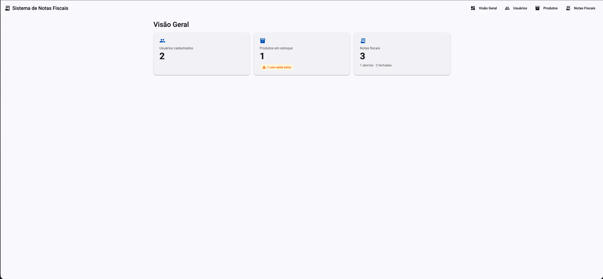

# Sistema de Notas Fiscais

Sistema de emissão de notas fiscais com arquitetura de microsserviços: **Angular** no frontend, **Go** (Gin + GORM) no backend, **PostgreSQL** como banco de dados e um microsserviço dedicado para geração de texto por IA (Groq).



## Arquitetura

- **Frontend**: Angular 22 + Angular Material + RxJS
- **Backend**: 4 microsserviços em Go (Gin + GORM), cada um com DDD (Domain-Driven Design) e seu próprio `go.mod`
- **Banco de dados**: PostgreSQL 16 (um banco lógico por serviço)
- **IA**: Groq (modelo `openai/gpt-oss-20b`), isolada em serviço próprio

| Serviço | Porta | Responsabilidade |
|---|---|---|
| [usuario](docs/usuario.md) | `:8080` | Cadastro de usuários |
| [estoque](docs/estoque.md) | `:8081` | Produtos e controle de saldo |
| [faturamento](docs/faturamento.md) | `:8082` | Emissão de notas fiscais (depende do estoque) |
| [ia](docs/ia.md) | `:8083` | Geração de descrição de produto via Groq (consumido pelo estoque) |

Para entender **como** os serviços se comunicam entre si (circuit breaker, concorrência otimista, idempotência, tratamento de erros) e o raciocínio por trás dessas escolhas, veja **[docs/arquitetura.md](docs/arquitetura.md)** — é o documento mais importante deste repositório para quem for revisar o código.

## Pré-requisitos

- Go 1.26+
- Node.js 18+ e Angular CLI (`npm install -g @angular/cli`)
- Docker & Docker Compose
- Uma chave de API do [Groq](https://console.groq.com/keys) (grátis, opcional — sem ela o sistema funciona normalmente, só a sugestão de descrição por IA fica indisponível)

## Como rodar

### 1. Configurar variáveis de ambiente

```bash
cp .env.example .env
# edite o .env e preencha GROQ_API_KEY se quiser usar a geração de descrição por IA
```

### 2. Subir o banco de dados

```bash
make docker-up
```

### 3. Subir todos os microsserviços + frontend

```bash
make run-all
```

Isso sobe `usuario` (8080), `estoque` (8081), `faturamento` (8082), `ia` (8083) e o frontend Angular (4200) em paralelo. As tabelas são criadas automaticamente na primeira execução (GORM `AutoMigrate`), sem precisar rodar migração à parte.

Prefere subir um serviço por vez (para debugar isoladamente)? Cada um tem seu próprio alvo: `make run-usuario`, `make run-estoque`, `make run-faturamento`, `make run-ia`, `make run-frontend`.

### 4. Acessar

- **Frontend**: http://localhost:4200
- **Health check** de cada serviço: `http://localhost:<porta>/health`

### Parar tudo

```bash
make stop-all
```

## Estrutura do repositório

```
.
├── frontend/                  # Angular (standalone components, lazy-loaded routes)
├── services/
│   ├── go.work                 # Workspace Go multi-módulo
│   ├── usuario/                 # Microsserviço de usuários
│   ├── estoque/                  # Microsserviço de estoque
│   ├── faturamento/               # Microsserviço de faturamento
│   └── ia/                         # Microsserviço de geração de texto por IA
├── docker/postgres/            # Script de criação dos bancos de teste
├── docker-compose.yml          # PostgreSQL
├── Makefile                    # Todos os comandos de desenvolvimento
├── .env.example
└── docs/                       # Documentação técnica detalhada (este índice abaixo)
```

Todos os serviços em Go seguem a mesma estrutura interna (`domain` → `application` → `infrastructure`), documentada em [docs/arquitetura.md](docs/arquitetura.md#padrão-de-código-ddd--cqrs-leve).

## Documentação

| Documento | Conteúdo |
|---|---|
| [docs/arquitetura.md](docs/arquitetura.md) | Padrões cross-cutting: comunicação entre serviços, circuit breaker, concorrência otimista, idempotência, tratamento de erros, variáveis de ambiente |
| [docs/usuario.md](docs/usuario.md) | Modelo de domínio, endpoints e regras do serviço de usuários |
| [docs/estoque.md](docs/estoque.md) | Modelo de domínio, endpoints e regras do serviço de estoque |
| [docs/faturamento.md](docs/faturamento.md) | Fluxo de emissão de nota fiscal, compensação e integração com o estoque |
| [docs/ia.md](docs/ia.md) | Como a geração de descrição por IA funciona e por que é um serviço separado |
| [docs/frontend.md](docs/frontend.md) | Estrutura do Angular, padrões de UI e como cada tela consome os microsserviços |

## Testes

```bash
make test              # suíte completa do serviço de usuários (requer make docker-up)
make test-concurrency   # só os testes de concorrência (goroutines disputando o mesmo registro)
```

Os testes de concorrência sobem múltiplas goroutines contra o banco real para provar que os controles de concorrência otimista e as restrições de unicidade (email/CPF) seguram sob disputa de verdade — não são só testes de unidade com mocks.

## Stack técnica (resumo)

| Camada | Tecnologias |
|---|---|
| Frontend | Angular 22, Angular Material, RxJS, TypeScript |
| Backend | Go 1.26, Gin, GORM, `go-playground/validator`, `sony/gobreaker` |
| Banco de dados | PostgreSQL 16 |
| IA | Groq API (`openai/gpt-oss-20b`) |
| Infraestrutura local | Docker Compose, Go workspaces (`go.work`) |
