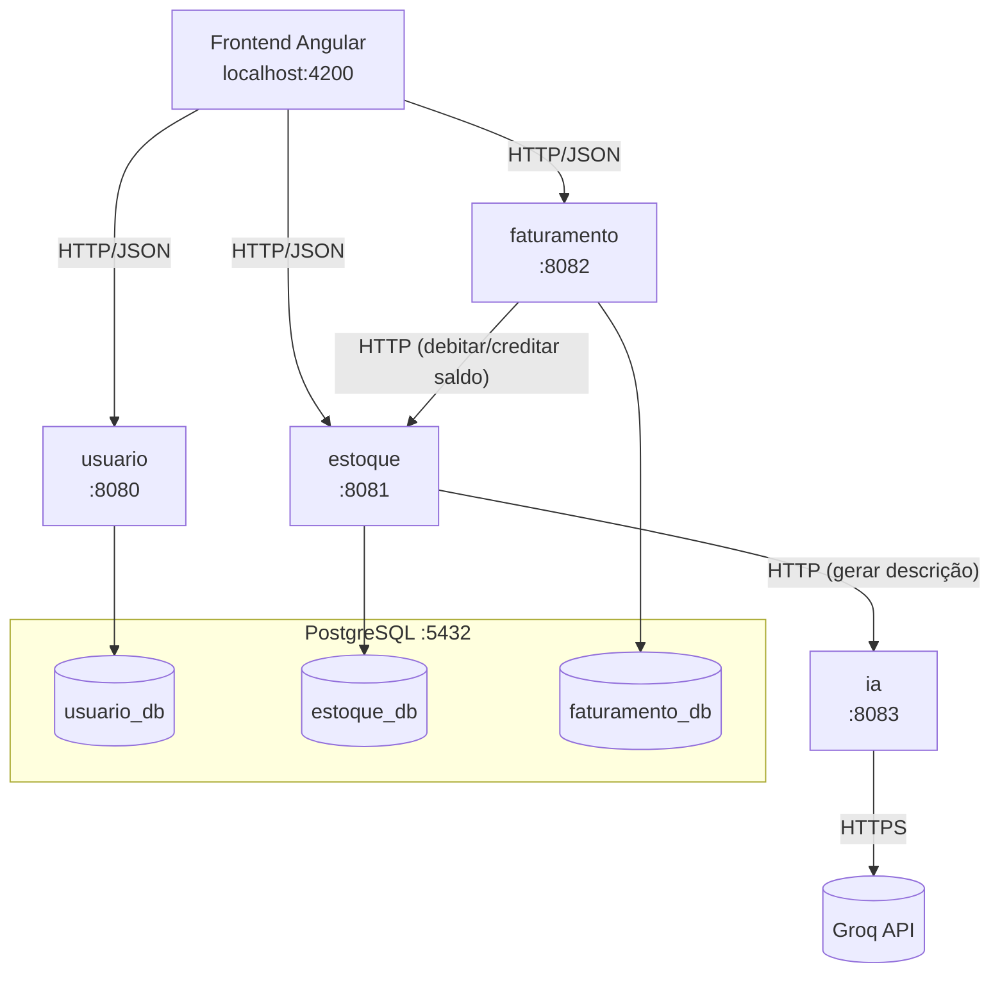

# Arquitetura

Este documento descreve as decisões e padrões que atravessam todos os microsserviços. Os detalhes específicos de cada serviço (entidades, endpoints, regras de negócio) estão nos documentos individuais:

- [usuario.md](./usuario.md)
- [estoque.md](./estoque.md)
- [faturamento.md](./faturamento.md)
- [ia.md](./ia.md)

## Visão geral



Cada serviço Go é independente: tem seu próprio `go.mod`, seu próprio banco de dados lógico dentro do mesmo Postgres, e só se comunica com os outros por HTTP — nunca acessando o banco de outro serviço diretamente. Isso é o que garante que cada um possa ser desenvolvido, testado e (em tese) escalado separadamente.

O `frontend` é o único cliente que fala com `usuario`, `estoque` e `faturamento` diretamente. O serviço `ia` não é exposto ao frontend: só o `estoque` fala com ele, porque hoje o único caso de uso de IA é gerar descrição de produto.

## Por que microsserviços aqui

O projeto é pequeno o bastante para caber num monólito, mas o objetivo era demonstrar fronteiras de domínio reais:

- **usuario** cuida do cadastro de pessoas.
- **estoque** cuida de produtos e saldo.
- **faturamento** emite notas fiscais e depende do estoque para debitar saldo — mas não tem acesso ao banco do estoque, só à API dele.
- **ia** isola a dependência de um provedor externo (Groq). Se o provedor cair, mudar ou o modelo for descontinuado, o blast radius fica contido nesse serviço — o resto do sistema continua funcionando (só a sugestão de descrição fica indisponível).

## Padrão de código: DDD + CQRS leve

Todos os serviços em Go seguem a mesma estrutura de pastas:

```
internal/
├── domain/            # Regra de negócio pura, sem dependência de framework
│   ├── entity/         # Aggregate roots (Usuario, Produto, NotaFiscal)
│   ├── valueobject/     # Tipos com validação própria (Email, CPF, Descricao...)
│   ├── repository/     # Interfaces de persistência (implementadas em infrastructure)
│   └── errors/          # Erros de domínio como variáveis sentinela (errors.New)
├── application/        # Casos de uso, um arquivo por operação
│   ├── command/         # Escritas: Create, Update, Delete, Debitar, Creditar...
│   ├── query/            # Leituras: Get, List
│   └── dto/               # Contratos de entrada/saída da API
└── infrastructure/     # Detalhes técnicos
    ├── http/             # Handlers Gin, router, middlewares
    ├── persistence/       # Implementação GORM dos repositórios
    └── database/           # Conexão com Postgres
```

A regra é sempre a mesma direção de dependência: `infrastructure` conhece `application`, que conhece `domain`; o inverso nunca acontece. O `domain` não importa GORM, Gin nem nenhuma lib HTTP — só valida regras de negócio e retorna erros sentinela (`var ErrX = errors.New(...)`).

Não é CQRS "de verdade" (não há barramento de eventos, nem bancos de leitura/escrita separados) — é só uma convenção de organização: cada operação de escrita é um `command`, cada leitura um `query`, cada um com seu próprio `Handle(ctx, ...)`. Isso facilita achar o código (o nome do arquivo já diz o que ele faz) e testar cada caso de uso isoladamente.

## Comunicação entre serviços: HTTP + Circuit Breaker

Dois pontos do sistema fazem chamadas síncronas entre serviços:

| Chamador | Chamado | Motivo |
|---|---|---|
| `faturamento` | `estoque` | Debitar/creditar saldo ao imprimir uma nota fiscal |
| `estoque` | `ia` | Gerar sugestão de descrição de produto |

Ambos os clientes HTTP seguem o mesmo padrão, usando [`sony/gobreaker`](https://github.com/sony/gobreaker):

- Depois de **3 falhas consecutivas** de infraestrutura (timeout, conexão recusada, 5xx), o circuito abre.
- Enquanto aberto, as próximas chamadas falham imediatamente (sem tentar rede) por **10 segundos**, evitando derrubar um serviço já saudável com uma fila de requisições para um serviço fora do ar.
- Respostas de negócio (ex: "produto não encontrado", "saldo insuficiente") **não contam como falha do circuito** — são respostas válidas de um serviço que está no ar e funcionando corretamente.

Exemplo real: `services/faturamento/internal/infrastructure/estoque/http_client.go` e `services/estoque/internal/infrastructure/ia/http_client.go` implementam o mesmo padrão, um para cada dependência.

## Consistência entre serviços: compensação, não transação distribuída

Como cada serviço tem seu próprio banco, não é possível usar uma transação SQL para garantir atomicidade entre "criar nota fiscal" e "debitar saldo no estoque". O fluxo de impressão de nota fiscal (`faturamento`) resolve isso com uma compensação manual:

1. Para cada item da nota, chama `estoque.DebitarSaldo`.
2. Se algum item falhar no meio do caminho (ex: saldo insuficiente no 3º de 5 itens), os itens já debitados com sucesso são **creditados de volta** (rollback lógico) e a nota permanece com status `Aberta`.
3. Só depois que todos os débitos forem confirmados a nota é fechada (`Fechar()`).

Isso é uma versão simplificada do padrão **Saga** (compensação em vez de transação distribuída). Detalhes em [faturamento.md](./faturamento.md).

## Concorrência otimista

`usuario`, `estoque` e `faturamento` guardam um campo `version` em cada registro. Toda atualização faz:

```sql
UPDATE produtos SET ..., version = version + 1 WHERE id = ? AND version = ?
```

Se `RowsAffected == 0`, outra requisição já alterou o registro entre a leitura e a escrita — o serviço retorna `ErrConcurrencyConflict` (HTTP 409). Endpoints acionados por outro serviço (débito/crédito de saldo do estoque) fazem **retry automático** (até 5 tentativas) porque um conflito de versão ali é esperado sob concorrência, não um erro do usuário; já num `PUT` vindo do frontend, o conflito é devolvido para o usuário decidir (recarregar e tentar de novo), porque a versão que ele estava editando pode ter ficado desatualizada.

## Idempotência

Todo endpoint de escrita (`POST`/`PUT`/`PATCH`) aceita um header opcional `Idempotency-Key`. O middleware (`infrastructure/http/middleware/idempotency_middleware.go`, replicado nos três serviços com banco) guarda a resposta da primeira execução vinculada à chave; se a mesma chave chegar de novo (ex: o frontend reenviou por timeout de rede), devolve a resposta salva sem repetir a operação. O frontend gera uma chave (UUID) antes de cada `POST`/`PUT`.

## Tratamento de erros e logging

Todo erro de domínio é uma variável sentinela (`errors.New`) exportada em `domain/errors`. Um middleware único (`ErrorHandler`) mapeia esses erros para status HTTP:

| Tipo de erro | HTTP |
|---|---|
| Validação de request (`binding`) | 400 |
| Não encontrado (`ErrXNotFound`) | 404 |
| Conflito (`ErrConcurrencyConflict`, `ErrXAlreadyExists`, saldo insuficiente) | 409 |
| Regra de negócio violada (`ErrXInvalido`) | 422 |
| Dependência externa fora do ar (circuit breaker aberto) | 503 |
| Erro repassado de outro serviço | 502 |
| Qualquer outro erro não mapeado | 500 |

Erros 5xx são sempre logados no servidor com método, rota e a mensagem de erro completa (`log.Printf`) — a resposta para o cliente continua genérica ("Erro interno do servidor"), para não vazar detalhes internos, mas quem estiver com o terminal do serviço aberto vê exatamente o que aconteceu. Isso foi uma correção deliberada: antes, um erro 500 não deixava nenhum rastro nos logs.

## Configuração

Todos os serviços leem variáveis de ambiente de um único `.env` na raiz do repositório (veja `.env.example`). Cada `main.go` tenta, em ordem, `.env`, `../../.env`, `../../../.env` e `../../../../.env` — o primeiro que existir é usado — para funcionar tanto rodando via `make run-<serviço>` (cwd em `services/<nome>`) quanto diretamente de dentro de `cmd/`.

| Variável | Serviço | Descrição |
|---|---|---|
| `DB_HOST`, `DB_PORT`, `DB_USER`, `DB_PASSWORD` | usuario, estoque, faturamento | Conexão com o Postgres |
| `USUARIO_SERVER_PORT` | usuario | Porta HTTP (padrão `8080`) |
| `ESTOQUE_SERVER_PORT` | estoque | Porta HTTP (padrão `8081`) |
| `FATURAMENTO_SERVER_PORT` | faturamento | Porta HTTP (padrão `8082`) |
| `IA_SERVER_PORT` | ia | Porta HTTP (padrão `8083`) |
| `ESTOQUE_SERVICE_URL` | faturamento | Base URL do estoque (padrão `http://localhost:8081/api`) |
| `IA_SERVICE_URL` | estoque | Base URL do serviço de IA (padrão `http://localhost:8083/api`) |
| `GROQ_API_KEY`, `GROQ_MODEL` | ia | Credenciais do provedor de IA (Groq) |
